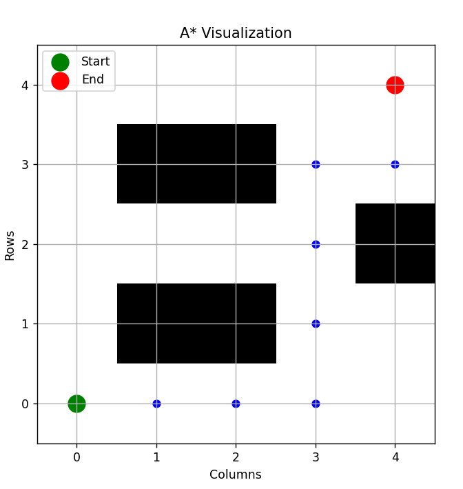
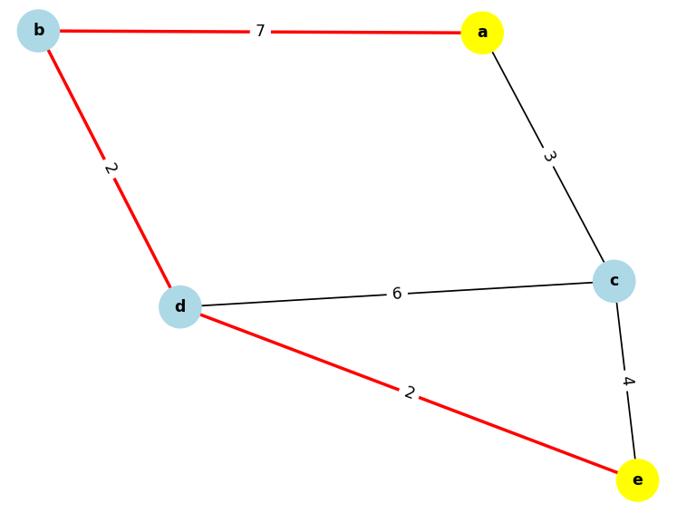
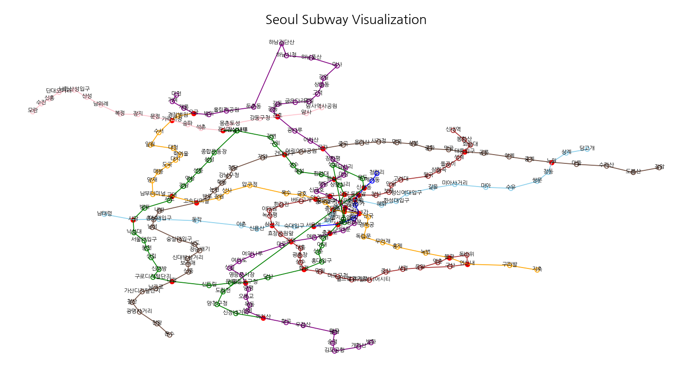

# Pathfinding Algorithm Repository

This repo includes two algorithms of path finding and Seoul subway map finding using this algorithms.

## Required Modules
- matplotlib (visualization)
- networkx (node and edge creation)
- pandas (data management)

## 1. A* and Dijkstra Algorithms(/algorithm)
- Implemented A* and Dijkstra algorithms.
- Both use heapq (priority queue), with Dijkstra based on graphs and A* based on matrices.
- Visualization is possible through the `visualize.py` file.

## 2. Implementation of Seoul Subway Map and Optimal Path (/subway-pathfind)
- Utilized the above algorithms to implement the Seoul subway map and calculate the optimal path to the destination based on these algorithms.
- All rights to the data used belong to the Seoul Transportation Corporation.
- `algorithm.py` file contains the core of this repo.

## 3. TODO things
- The Seoul subway map is not accurate.
- The map is not easy to understand.
- In some cases, the path is not found appropriate. (because of slightly incorrect graph)

## 4. References
https://blog.naver.com/honey_gguri/222045386773 
https://gazelle-and-cs.tistory.com/115 
https://velog.io/@717lumos

## 5. License
- The MIT license will be applied only to `subway-pathfind`.
- If you want more information, please refer to [LICENSE](LICENSE) file.
